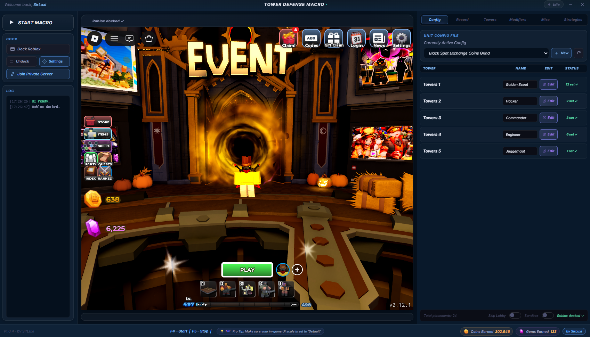

# Tower Defense Simulator Macro

---

<!-- Replace the line below with your actual screenshot once uploaded (see the Screenshot Guide section) -->
<--  -->

##  Getting Started

### Installation
1. Go to the [**Releases**](../../releases/latest) tab
2. Download `NoName Macro.exe`
3. Run the macro — if Windows Defender warns you, click **More info → Run anyway** (this is normal for new apps without an EV certificate)
4. Launch the macro and open Roblox

### Usage
1. Load into **Tower Defense Simulator**
2. Click **Dock** to fix the Roblox window into the macro UI
3. Setup the macro and select the strategy to do or even record your own in the left panel.
4. Press **Start Macro** and step away!

| Hotkey | Action |
|--------|--------|
| `F4` | Start Macro |
| `F5` | Stop Macro |

*Built by SirLuxi*

